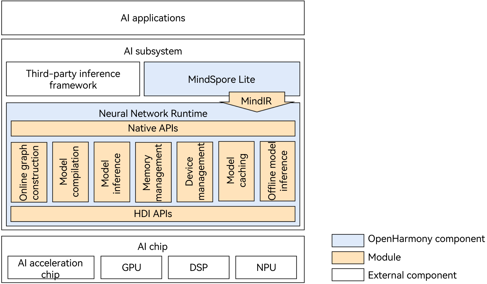

# Neural Network Runtime

## Introduction

Neural Network Runtime (NNRt) functions as a bridge to connect the upper-layer AI inference framework and bottom-layer acceleration chip, implementing cross-chip inference computing of AI models.

As shown in Figure 1, NNRt opens Native APIs for the AI inference framework to access. Currently, NNRt interconnects with the built-in [MindSpore Lite](https://gitee.com/openharmony/third_party_mindspore) inference framework of the system. In addition, NNRt opens HDI APIs for device-side AI acceleration chips (such as NPUs and DSPs) to access the OpenHarmony hardware ecosystem. AI applications can directly use underlying chips to accelerate inference and computing through the AI inference framework and NNRt.

NNRt and MindSpore Lite use MindIR unified intermediate representation to reduce unnecessary model conversion in the intermediate process, making model transfer more efficient.

Generally, the AI application, AI inference engine, and NNRt are in the same process, and the chip driver runs in another process. The transmission of models and computing data between the two processes should be implemented by IPC. NNRt architecture implements the HDI client based on the HDI APIs. Accordingly, chip vendors need to implement and open the HDI services through HDI APIs.

**Figure 1** NNRt architecture


## Directory Structure

```text
/foundation/ai/neural_network_runtime
├── common                         # Common functions
├── figures                        # Images referenced by README
├── example                        # Development samples
│   ├── deep_learning_framework    # Application/Inference framework development samples
│   └── drivers                    # Device driver development samples
├── frameworks
│   └── native                     # Framework code
│       └── ops                    # Operator header files and implementation
├── interfaces                     # APIs
│   ├── innerkits                  # Internal APIs
│   └── kits                       # External APIs
└── test                           # Test cases
    ├── system_test                # System test cases
    └── unittest                   #  Unit test cases
```

## Compilation and Building

In the root directory of the OpenHarmony source code, call the following command to compile NNRt separately:
```shell
./build.sh --product-name rk3568 --ccache --build-target neural_network_runtime --jobs 4
```
> **Note:** 
--product-name: product name, for example, <b>Hi3516DV300</b> and <b>rk3568</b>.
--ccache: The cache function is used during compilation.
--build-target: name of the compiled component.
--jobs: number of compilation threads, which can accelerate compilation.

## Description

### API Description

- [Native API reference](https://gitee.com/openharmony/docs/blob/master/en/application-dev/reference/native-apis/_neural_network_runtime.md)
- [HDI API reference](https://gitee.com/openharmony/drivers_interface/tree/master/nnrt)

### How to Use

- For details about AI inference engine/application development, see Neural Network Runtime App Development Guide.
- For details about how to develop AI acceleration chip drivers and devices, see Neural Network Runtime Device Development Guide.

## Repositories Involved

- [**neural_network_runtime**](https://gitee.com/openharmony/neural_network_runtime)
- [third_party_mindspore](https://gitee.com/openharmony/third_party_mindspore)
