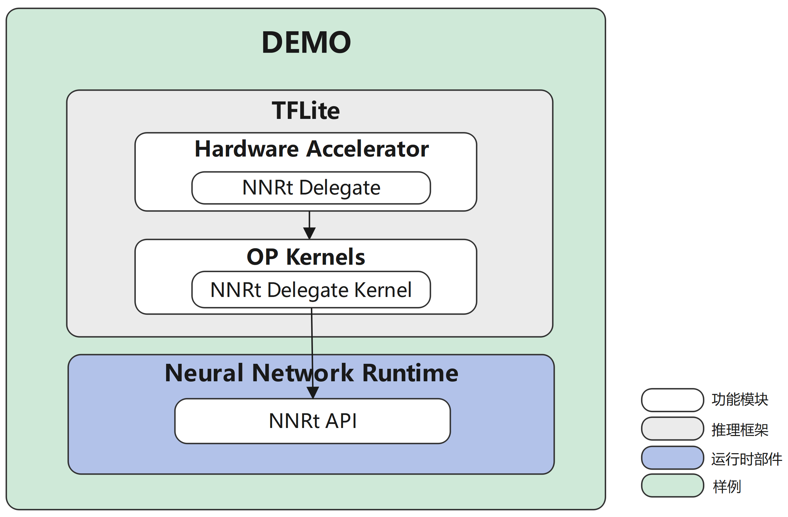

# TensorFlow Lite接入NNRt Delegate开发指南

## 概述
神经网络运行时部件（NNRt）是跨设备的AI运行时框架，作为端侧推理框架和专用加速芯片的中间桥梁，为端侧推理框架提供了统一的Native接口。

本demo旨在介绍TensorFlow Lite推理框架如何接入NNRt，并在专有芯片上加速推理，接入OpenHarmony社区生态。

本demo根据用户输入参数（模型、标签、模型输入shape、循环浮点推理次数、是否允许动态尺寸推理、以及是否打印结果等）完成标签分类模型推理，用户可通过打印信息观察在不同条件下的模型推理性能、精度和预测类别。

## 基本概念
在开发前，开发者需要先了解以下概念，以便更好地理解全文内容：
- NNRt：Neural Network Runtime，神经网络运行时，是本指导主要介绍的部件。
- OHOS：OpenHarmony Operating System，OpenHarmony操作系统。

## 约束与限制
1. 系统版本：OpenHarmonyOS 3.2 Beta5及以上版本。
2. 开发环境：Ubuntu 18.04及以上。
3. 接入设备：OpenHarmony定义的标准设备。
4. 其他开发依赖：
获取TensorFlow Lite头文件，[获取链接](https://github.com/tensorflow/tensorflow/tree/master/tensorflow/lite)。
    - tensorflow-lite.so及其依赖库(参考[编译指导](#调测命令)编译生成)，目前完成在tensorflow lite 2.6版本上的测试。
    - NNRt动态库libneural_network_runtime.z.so，参考[编译指导](https://gitee.com/openharmony-sig/neural_network_runtime/blob/master/README_zh.md)编译生成。
    - mobilenetv2的Tensorflow lite模型，[获取链接](https://storage.googleapis.com/mobilenet_v2/checkpoints/mobilenet_v2_1.4_224.tgz)。
    - 标签文件labels.txt，可从[压缩包](https://storage.googleapis.com/download.tensorflow.org/models/mobilenet_v1_1.0_224_frozen.tgz)中解压得到。
    - 测试图片grace_hopper.bmp，[获取链接](https://github.com/tensorflow/tensorflow/blob/master/tensorflow/lite/examples/label_image/testdata/grace_hopper.bmp)。

## 运作机制

**图1** 运作机制



以TensorFlow lite的MobileNetv2模型进行标签分类任务为例，实现调用NNRt API在指定芯片上加速推理，主要有以下三个部分：
1. 通过TFLite delegate机制，创建NNRt Delegate，并接入TFLite的Hardware Accelerator中。
2. 将TensorFlow lite模型中能在NNRt上运行的op kernels，替换成NNRt Delegate kernels。
3. 推理过程中，被替换成NNRt Delegate Kernel的op kernel会调用Neural Network Runtime中的API在指定芯片上完成模型的构图、编译和执行。

## 开发流程

**图2** 开发流程


主要开发步骤包括命令行参数解析、创建NNRt Delegate、TFLite nodes的替换、tensors的内存分配、执行推理、结果查看等，具体如下：
1. 解析运行demoe的命令，初始化模型推理所需参数和创建NNRt Delegate的options。
2. 调用Tensorflow lite的BuildFromFile接口完成Tensorflow lite模型的构建。
3. 根据demo的运行命令解析模型是否需要动态输入，如果需要，则调用ResizeInputTensor接口更改模型输入大小。
4. 创建DelegateProviders，并调用DelegateProviders的CreateAllRankedDelegates接口创建NnrtDelegate；创建NnrtDelegate过程中，通过dlopen打开NNRt的动态库来加载NNRt API。
5. 调用ModifyGraphWithDelegate接口完成Node替换，其中该步分四个步骤：
    - 初始化NnrtDelegate。
    - 判断TFLite图中各node是否支持在NnrtDelegate上运行，返回支持的node集合。
    - 调用TFLiteRegistration注册NnrtDelegate，并初始化init，prepare，invoke成员函数指针，指向NnrtDelegateKernel的Init，Prepare和run函数方法。
    - 替换TensorFlow Delegate的node为已注册的NNrt delegate kernel，并调用Init完成构图过程。
6. 用户调用AllocateTensors，完成tensors内存分配和图编译。其中，支持在NNRtDelegate上运行的node会调用NnrtDelegateKernel的prepare接口完成编译，不支持的会调用tflite operation kernels的prepare编译。
7. 导入输入数据并调用Invoke完成图执行。
8. 结果输出。


## 开发步骤
本节主要描述NNRt接入TFLite的TFLite-delegate代理机制，重点对TFLite调用delegate的流程和delegate对接NNRt的方式进行了介绍。
TensorFlow Lite Delegate有两个基类DelegateProvider、TfLiteDelegate，本节主要描述继承这两个基类得到子类NnrtDelegate和NnrtDelegateProvider。

本demo主要文件目录结构如下图：
```text
.
├── CMakeLists.txt
├── delegates
│   └── nnrt_delegate
│       ├── CMakeLists.txt                     # 生成libnnrt_delegate.so的交叉编译规则文件
│       ├── nnrt_delegate.cpp                  # NnrtDelegate源文件，对接到NNRt上，使TensorFlow Lite模型能运行在加速芯片上
│       ├── nnrt_delegate.h                    # NnrtDelegate头文件
│       ├── nnrt_delegate_kernel.cpp           # NnrtDelegateKernel源文件，将TensorFlow Lite模型中的operators替换成Nnrt中的operators
│       ├── nnrt_delegate_kernel.h             # NnrtDelegateKernel头文件
│       ├── nnrt_delegate_provider.cpp         # 用于创建NNrtDelegate
│       ├── nnrt_op_builder.cpp                # NnrtOpBuilder源文件，给每个operators设置输入输出tensor和operation属性
│       ├── nnrt_op_builder.h                  # NnrtOpBuilder头文件
│       ├── nnrt_utils.cpp                     # 用于辅助创建NnrtDelegate工具方法的源文件
│       ├── nnrt_utils.h                       # 用于辅助创建NnrtDelegate工具方法的头文件
│       └── tensor_mapping.h                   # TensorFlow Lite Tensor到Nnrt tensor的转换头文件
├── label_classify
│   ├── CMakeLists.txt                         # 生成可执行文件label_classify的交叉编译规则文件
│   ├── label_classify.cpp                     # 生成可执行文件label_classify的源文件
│   └── label_classify.h                       # 生成可执行文件label_classify的头文件
├── nnrt
│   ├── CMakeLists.txt                         # 生成libnnrt_implementation.so的交叉编译规则文件
│   ├── nnrt_implementation.cpp                # 生成libnnrt_implementation.so的源文件，用于加载NNRt Api
│   └── nnrt_implementation.h                  # 生成libnnrt_implementation.so的头文件
└── tools
    ├── bitmap_helpers.cpp                     # 用于读取输入的bmp格式图片源文件
    ├── bitmap_helpers.h                       # 用于读取输入的bmp格式图片头文件
    ├── get_topn.h                             # 用于返回推理的top N结果
    ├── log.h                                  # 日志模块文件
    ├── utils.cpp                              # 用于辅助模型推理输入和输出工具方法的源文件
    └── utils.h                                # 用于辅助模型推理输入和输出工具方法的头文件
```
1. 创建NnrtDelegate类。

    NnrtDelegate类定义在nnrt_delegate文件中，用于对接NNRt，使TensorFlow Lite模型能运行在加速芯片上。用户需要实现DoPrepare接口、GetSupportedNodes接口、GetDelegateKernelRegistration接口，详细代码参考[链接](https://gitee.com/openharmony-sig/neural_network_runtime/blob/master/example/deep_learning_framework/tflite/delegates/nnrt_delegate/nnrt_delegate.cpp)。主要步骤有以下两点：
    - 获取TensorFlow Lite中能替换的nodes。
        ```cpp
        TfLiteNode* node = nullptr;
        TfLiteRegistration* registration = nullptr;
        for (auto nodeIndex : TfLiteIntArrayView(executionPlan)) {
            node = nullptr;
            registration = nullptr;
            TF_LITE_ENSURE_STATUS(context->GetNodeAndRegistration(context, nodeIndex, &node, &registration));
            if (NnrtDelegateKernel::Validate(registration->builtin_code)) {
                supportedNodes.emplace_back(nodeIndex);
            } else {
                TFLITE_LOG_PROD(TFLITE_LOG_WARNING,
                    "[NNRT-DELEGATE] Get unsupportted node: %d.", registration->builtin_code);
            }
        }
        ```

    - 注册的Delegate kernel，初始化TfLiteRegistration的init，prepare，invoke成员函数指针，指向NnrtDelegateKernel的Init，Prepare和run函数方法。
        ```cpp
        nnrtDelegateKernel.init = [](TfLiteContext* context, const char* buffer, size_t length) -> void* {
            if (buffer == nullptr) {
                return nullptr;
            }

            const TfLiteDelegateParams* params = reinterpret_cast<const TfLiteDelegateParams*>(buffer);
            auto* delegateData = static_cast<Data*>(params->delegate->data_);
            NnrtDelegateKernel* state = new (std::nothrow) NnrtDelegateKernel(delegateData->nnrt);
            if (state == nullptr) {
                TFLITE_LOG_PROD(TFLITE_LOG_ERROR, "Failed to create NnrtDelegateKernel instance.");
                return state;
            }

            TfLiteStatus status = state->Init(context, params);
            if (status != kTfLiteOk) {
                TFLITE_LOG_PROD(TFLITE_LOG_ERROR, "Failed to init NnrtDelegateKernel.");
                delete state;
                state = nullptr;
            }
            return state;
        };

        nnrtDelegateKernel.prepare = [](TfLiteContext* context, TfLiteNode* node) -> TfLiteStatus {
            if (node == nullptr) {
                TFLITE_LOG_PROD(TFLITE_LOG_ERROR, "Failed to prepare delegate kernels, the node is nullptr.");
                return kTfLiteError;
            }

            NnrtDelegateKernel* state = reinterpret_cast<NnrtDelegateKernel*>(node->user_data);
            return state->Prepare(context, node);
        };

        nnrtDelegateKernel.invoke = [](TfLiteContext* context, TfLiteNode* node) -> TfLiteStatus {
            if (node == nullptr) {
                TFLITE_LOG_PROD(TFLITE_LOG_ERROR, "Failed to invoke delegate kernels, the node is nullptr.");
                return kTfLiteError;
            }

            NnrtDelegateKernel* state = reinterpret_cast<NnrtDelegateKernel*>(node->user_data);
            return state->Invoke(context, node);
        };
        ```

2. 创建NnrtDelegateProvider。

    NnrtDelegateProvider定义在nnrt_delegate_provider文件中，用于创建NNrtDelegate，完成与TFLite的对接。主要步骤有以下两点：
    - 注册NnrtDelegateProvider
      ```cpp
        REGISTER_DELEGATE_PROVIDER(NnrtDelegateProvider);
      ```

    - 创建CreateTfLiteDelegate主要有以下几步
      ```cpp
      NnrtDelegate::Options options;

      const auto* nnrtImpl = NnrtImplementation();
      if (!nnrtImpl->nnrtExists) {
          TFLITE_LOG(WARN) << "NNRT acceleration is unsupported on this platform.";
          return delegate;
      }

      Interpreter::TfLiteDelegatePtr TfLiteDelegatePtr(new (std::nothrow) NnrtDelegate(nnrtImpl, options),
          [](TfLiteDelegate* delegate) { delete reinterpret_cast<NnrtDelegate*>(delegate); });
      ```

3. label_classify.cpp中加载NnrtDelegate，并完成node的替换。
    ```cpp
    interpreter->ModifyGraphWithDelegate(std::move(delegate.delegate))
    ```


## 调测命令
1. 编译生成Tensorflow Lite库及其依赖库。

    请参考[Tensorflow Lite交叉编译指南](https://www.tensorflow.org/lite/guide/build_cmake_arm)，同时在```tensorflow/lite/CMakeLists.txt```中增加以下内容：
    ```text
    list(APPEND TFLITE_EXTERNAL_DELEGATE_SRC
        ${TFLITE_SOURCE_DIR}/tools/delegates/delegate_provider.cc
        # ${TFLITE_SOURCE_DIR}/tools/delegates/external_delegate_provider.cc
        ${TFLITE_SOURCE_DIR}/tools/tool_params.cc
        ${TFLITE_SOURCE_DIR}/tools/command_line_flags.cc
    )
    ```
    ```text
    target_link_libraries(tensorflow-lite
      PUBLIC
        Eigen3::Eigen
        NEON_2_SSE
        absl::flags
        absl::hash
        absl::status
        absl::strings
        absl::synchronization
        absl::variant
        farmhash
        fft2d_fftsg2d
        flatbuffers
        gemmlowp
        ruy
        ${CMAKE_DL_LIBS}
        ${TFLITE_TARGET_DEPENDENCIES}
    )
    ```

2. 编译生成NNRt库libneural_network_runtime.z.so。

    请参考[编译指导](https://gitee.com/openharmony-sig/neural_network_runtime/blob/master/README_zh.md)，编译命令如下：
    ```shell
    ./build.sh --product-name rk3568 –ccache --jobs=16 --build-target=neural_network_runtime
    ```

3. 用cmake编译北向demo。

    - TensorFlow Lite头文件和依赖库配置。
    
      将[TensorFlow Lite头文件](https://github.com/tensorflow/tensorflow/tree/master/tensorflow/lite)和编译生成的TensorFlow Lite库，分别放在```deep_learning_framework/lib_3rd_nnrt_tflite/include/tensorflow/lite/```和```deep_learning_framework/lib_3rd_nnrt_tflite/com/arm64-v8a/lib/```下。

    - 交叉编译工具配置。

      在社区的[每日构建](http://ci.openharmony.cn/dailys/dailybuilds)下载对应系统版本的ohos-sdk压缩包，从压缩包中提取对应平台的Native开发套件；指定ohos的cmake, ohos.toolchain.cmake路径，在```foundation/ai/neural_network_runtime/example/cmake_build/build_ohos_tflite.sh```中替换以下两行：
        ```shell
        ./tool_chain/native/build-tools/cmake/bin/cmake \
        -DCMAKE_TOOLCHAIN_FILE=./tool_chain/native/cmake_build/cmake/ohos.toolchain.cmake \
        ```

    - 修改交叉编译文件。

      进入```foundation/ai/neural_network_runtime/example/cmake_build```，执行以下修改：

        如果需要在arm32架构的CPU上运行：

          # 修改```tflite/CMakeLists.txt```
            ```text
            set(CMAKE_CXX_FLAGS "-pthread -fstack-protector-all -fPIC -D_FORTIFY_SOURCE=2 -march=armv7-a")
            ```
          # 执行编译命令
            ```shell
            bash build_ohos_tflite.sh armeabi-v7a
            ```

        如果需要在arm64架构的CPU上运行：

          # 修改```tflite/CMakeLists.txt```
            ```text
            set(CMAKE_CXX_FLAGS "-pthread -fstack-protector-all -fPIC -D_FORTIFY_SOURCE=2 -march=armv8-a")
            ```

          # 执行编译命令
            ```shell
            bash build_ohos_tflite.sh arm64-v8a
            ```

    - 创建目录

      在```example/deep_learning_framework/```目录下创建lib和output两个文件夹：
        ```shell
        mkdir lib output
        ```

    - 执行链接命令

      进入```foundation/ai/neural_network_runtime/example/cmake_build```，执行链接命令：
        ```shell
        make
        ```

    - 结果查看

      北向demo成功编译完成后会在```deep_learning_framework/lib```生成libnnrt_delegate.so和libnnrt_implementation.so，在```deep_learning_framework/output```下生成label_classify可执行文件，目录结构体如下所示：

        ```text
        deep_learning_framework
        ├── lib
        │   ├── libnnrt_delegate.so                 # 生成的TensorFlow Lite nnrt delegate库
        │   └── libnnrt_implementation.so           # 生成的nnrt在TensorFlow Lite中接口实现库
        └── output
            └── label_classify                      # 生成的可执行文件
        ```

4. 在开发板上运行北向demo。

    - 推送文件至开发板

      将步骤1生成的libnnrt_implementation.so、libnnrt_delegate.so和可执行文件label_classify，libneural_network_runtime.z.so、tensorflow-lite.so及其依赖的库、mobilenetv2.tflite模型、标签labels.txt、测试图片grace_hopper.bmp推送到开发板上：
        ```shell
        # 假设上述待推送文件均放在push_files/文件夹下
        hdc_std file send push_files/ /data/demo/
        ```

    - 执行demo

      进入开发板，执行demo前需要添加环境变量，文件执行权限等:
        ```shell
        # 进入开发板
        hdc_std shell

        # 进入推送文件目录，并增加可执行文件权限
        cd /data/demo
        chmod +x ./label_classify

        # 添加环境变量
        export LD_LIBRARY_PATH=/data/demo:$LD_LIBRARY_PATH

        # 执行demo，-m tflite模型， -i 测试图片， -l 数据标签， -a 1表示使用nnrt, 0表示不使用nnrt推理，-z 1 表示打印输出张量大小的结果
        ./label_classify -m mobilenetv2.tflite -i grace_hopper.bmp -l labels.txt -a 1 -z 1
        ```

    - 结果查看

      demo成功执行后，可以看到以下运行结果：
        ```text
        INFO: invoked, average time: 194.972 ms
        INFO: 0.536433: 653 653:military uniform
        INFO: 0.102077: 835 835:suit, suit of clothes
        INFO: 0.0398081: 466 466:bulletproof vest
        INFO: 0.0251576: 907 907:Windsor tie
        INFO: 0.0150422: 440 440:bearskin, busby, shako
        ```

## 开发实例
完整demo可以参考社区实现[Demo实例](https://gitee.com/openharmony-sig/neural_network_runtime/tree/master/example/deep_learning_framework)。
